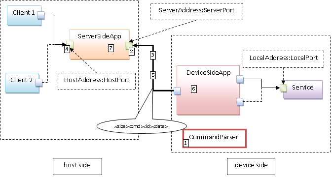
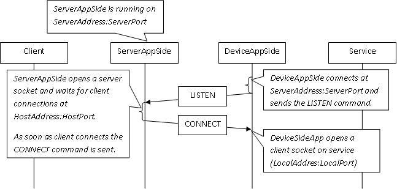
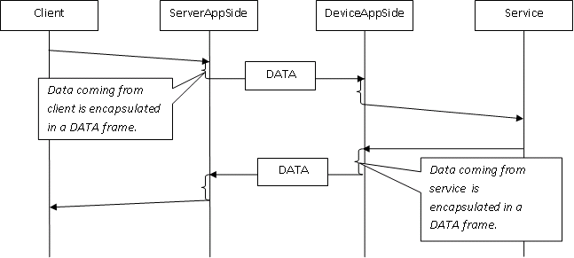
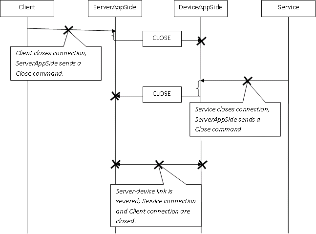

TCP Remote Connection
=====================

Presentation
============

#### 1.1.Purpose and Principle

This document defines the TCP remote connection feature of the
Agent. \
This feature allows a client to connect seamlessly to a
service through a device running Agent even if the device's IP
address is private.\
 Figure 1 shows the principle scheme of a client (host) accessing a
service.\
\
 \
 Figure 1: TCP Remote Connection principle

#### 1.2.Implementation

Figure 2 illustrates the reality the connection of a client to a service
through a device running the Agent.\
 \
 Figure 2: Remote connection scheme

Here after is described the classical connection use case.\
 **Client** (host side) wants to connect seamlessly on **Service** of
the device (device side).\
\
1. CommandParser receives, extracts and executes the TCPRemoteConnect
   command with valid parameters **ServerAddress**,
   **ServerPort**,**LocalAddress**, **LocalPort**.\
   ServerAddress:ServerPort, is the server socket on the
   **ServerSideApp**. LocalAddress:LocalPort is the server socket on the
   **Service**.\
2. **DeviceSideApp** connects at ServerAddress:ServerPort.\
3. **DeviceSideApp** sends LISTEN command to **ServerSideApp**.\
4. Upon reception of the LISTEN command, **ServerSideApp** creates
   server socket HostAddress:HostPort and wait for client connections.\
5. As soon as a Client connects, **ServerSideApp** sends a CONNECT
   command to make **DeviceSideApp** connect at LocalAddress:LocalPort.\
6. As soon as socket LocalAddress:LocalPort is closed, **DeviceSideApp**
   sends CLOSE command to make **ServerSideApp** close all its client
   sockets HostAddress:HostPort.\
7.Inversely if the client socket HostAddress:HostPort is closed,
  **ServerAppSide** sends CLOSE command to make **DeviceSideApp** closes
  its client sockets LocalAddress:LocalPort.

If the **ServerAddress:ServerPort** socket is down (whatever the
reason). **ServerAppSide** closes all its **HostAddress:HostPort**
client sockets and **DeviceAppSide** closes all its
**LocalAddress:LocalPort** client sockets\*.\*\
 Obviously we need a specific protocol to channel data and commands
through the **ServerAddress:ServerPort** socket.

#### 1.3.Specific protocol

Data and commands are channeled through the server device link using a
big endian binary protocol:

- [Payload size (2b)|CommandId (1b)|ClientId(1b)][Payload (Payload sizeb)]\
 CommandId:\
- CONNECT = 1, connect command sent by ServerAppSide with parameters
  local address and local port\
- CLOSE = 2, close command sent by the DeviceAppSide without parameters\
- DATA = 3, this command indicates a data exchange\
- LISTEN = 4, listen command sent by DeviceAppSide without parameters

#### 1.4.Interactions

This figure describes the server device interactions when the TCP remote
connection is established.\
 \
 Figure 3: TCP remote connection\
\
This one emphases on the data exchanges.\
 \
 Figure 4: Data exchanges\
\

This one shows the three closing cases:

- At client request
- At service request
- When the server device link is severed

 \
 Figure 5: Connection closing

Examples: lua implementation
============================

See [TCPRemoteConnect command definition](Device_Management.html)\
 To start the device side of the TCP remote connection:

~~~~{.lua}
CMD_TCPRemoteConnect = require 'DeviceManagement.TCPRemoteConnect'
local local_address = '10.41.51.152'
local local_port = 23
-- server address and port are stored in the Agent configuration
_,err = CMD_TCPRemoteConnect(""); p(err)
~~~~

